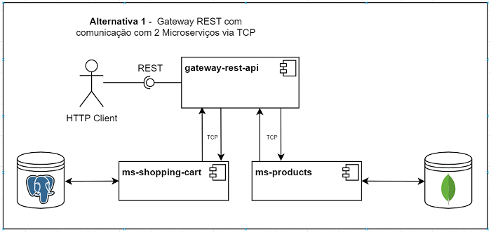
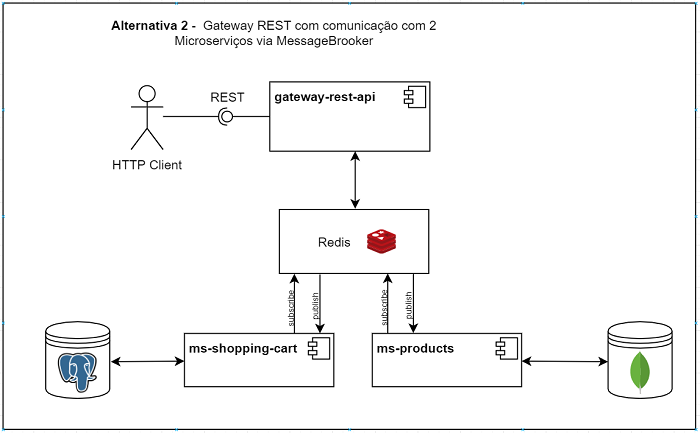
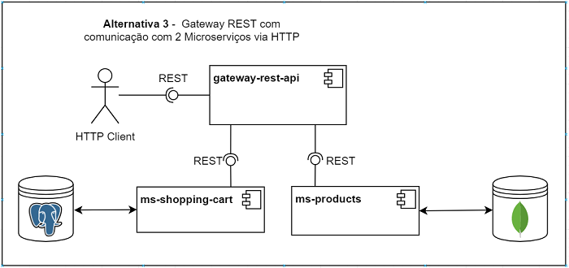

# 🔰 Introdução

Este projeto foi desenvolvido numa framework de nodejs, denominada NestJS que tem como vantagens a sua escalabilidade, a sua documentação e rapidez de desenvolvimento.

# ❓ Problema
O problema a resolver é constituido por 3 aplicações distintas com as seguintes especificidades:

## 🌐 Rest Api
- Deverá conter endpoints:
    - para obter todos os produtos.
    - para adicionar produto ao carrinho de compras.
    - para remover produto do carrinho de compras.
    - para obter carrinho de compras.

## 📦 Micro serviço de produto
- Deverá fazer a persistência dos dados dos produtos numa db NoSQL, como MongoDB, e utilizar um ORM como o mongoose.

## 📦 Micro serviço de carrinho de compras
- Deverá fazer a persistência dos dados dos produtos numa db SQL, como PostgreSQL, e utilizar um ORM como o typeORM.

 

# 📈 Análise

### Foram identificadas 3 possíveis soluções para o problema:

### Arquitetura 1

Gateway REST com comunicação os 2 microserviços via TCP.

### Arquitetura 2

Gateway REST com comunicação os 2 microserviços via MessageBrooker.

### Arquitetura 3

Gateway REST com comunicação os 2 microserviços via HTTP.

 

# 📜 Decisões

- A arquitetura escolhida foi a **Arquitetura 1**  por responder diretamente ao que é pedido no problema e também por não se justificar a implementação de um Redis com mecanimo publish/subscribe, uma vez que os testes a efetuar serão feitos utilizando o Postman e não haverá lugar para múltiplos pedidos em simultâneo.

- As duas base de dados a utilizar serão criadas utilizando uma Docker image para cada uma. (Ver seccão de configurações)

- Optou-se por criar endpoints para fazer o CRUD de ambos os conceitos, products e shopping-cart, embora que no caso do shopping-cart apenas seja atualizado o conteúdo do array de products.

- A interface da aplicação gateway-rest-api estará disponivel via Swagger, onde contém toda a definição dos endpoints e também a estrutura de DTOs de request e de response. 
    - Abrir documentação Swagger em formato [json](./GatewayWith2MSviaTCP/gateway-rest-api/swagger.json), copiar e colar na página http://editor.swagger.io .
    - Ou em alternativa quando a aplicação estiver em execução entrar em http://localhost:3000/docs .

- Ao criar shopping-cart entendeu-se que o array de products iria estar vazio, o valor de totalQuantity estar a 0 e o valor de totalPrice estar também a 0.

- O endpoint de adicionar/remover product do shopping-cart apenas receve o productId, uma vez que o microserviço ms-shopping-cart tem de consultar o microserviço ms-products para verificar e obter os detalhes do product recebido.

- O endpoint de adicionar/remover product do shopping-cart é um PUT, uma vez que será efetuada um update ao shopping-cart.

 

# ⚙️ Configurações

As aplicações desenvolvidas têm um ficheiro .env onde estão as properties especificas de cada uma.

## gateway-rest-api

    ## Products microservice properties:
    MS_PRODUCTS_ADDRESS='127.0.0.1'
    MS_PRODUCTS_PORT=4000

    ## Shopping cart microservice properties
    MS_SHOPPING_CART_ADDRESS='127.0.0.1'
    MS_SHOPPING_CART_PORT=5000

## ms-shopping-cart
    ## Self properties:
    MS_SHOPPING_CART_HOST='127.0.0.1'
    MS_SHOPPING_CART_PORT=5000

    ## DB Properties
    POSTGRES_HOST=localhost
    POSTGRES_PORT=5432
    POSTGRES_USER=admin
    POSTGRES_PASSWORD=admin
    POSTGRES_DB=postgresql

## ms-products
    ## Self properties:
    HOST='127.0.0.1'
    PORT=4000

    ## DB Properties
    MONGOURI=mongodb://localhost:27017

 

# ▶️ Instruções para execução

## Docker image - PostgreSQL (ms-shopping-cart)
    Dentro da aplicação ms-shopping-cart está o ficheiro docker-compose.yml e o ficheiro docker.env.
    As configurações deste ficheiro deverão ser idênticas às mencionadas em cima no ficheiro .env da aplicação ms-shopping-cart.
    Dentro do ficheiro docker-compose.yml está também uma aplicação denominada de pgadmin que após arranque da Docker image permitirá aceder a um GUI para a DB.
 
    Instruções: 
        - Posicionar-se na pasta do ms-shopping-cart e correr o comando "docker-compose up" no terminal/powershell.

        - Para ver a DB abrir o browser e correr http://localhost:8080 e colocar os dados de login configurados no ficheiro docker.env (usr:admin@admin.com || pwd:admin). 

## Docker image - MongoDB (md-products)
    Dentro da aplicação ms-products está o ficheiro docker-compose.yml.
    As configurações deste ficheiro deverão ser idênticas às mencionadas em cima no ficheiro .env da aplicação ms-products.
    Dentro do ficheiro docker-compose.yml está também uma aplicação denominada de mongoclient que após arranque da Docker image permitirá aceder a um GUI para a DB.

        Instruções: 
        - Posicionar-se na pasta do ms-products e correr o comando "docker-compose up" no terminal/powershell.

        - Para ver a DB abrir o browser e correr http://localhost:3030.

## Aplicação gateway-rest-api

    Posicionar-se na pasta do gateway-rest-api e executar o comando:
    nest start 

## Aplicação ms-shopping-cart

    Posicionar-se na pasta do ms-shopping-cart e executar o comando:
    nest start 

## Aplicação ms-products

    Posicionar-se na pasta do ms-products e executar o comando:
    nest start 

## Collection do Postman
    Obter [aqui](./GatewayWith2MSviaTCP/gateway-rest-api/gateway-api.postman_collection.json) collection do postman.
