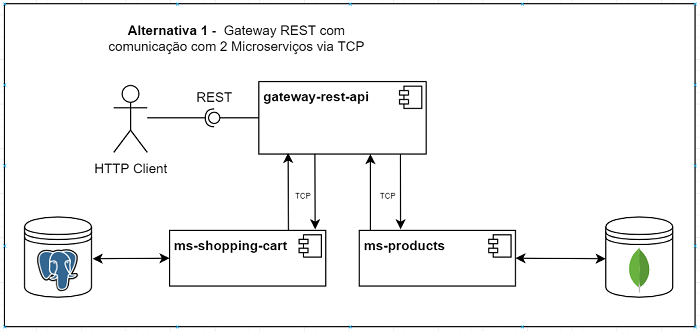
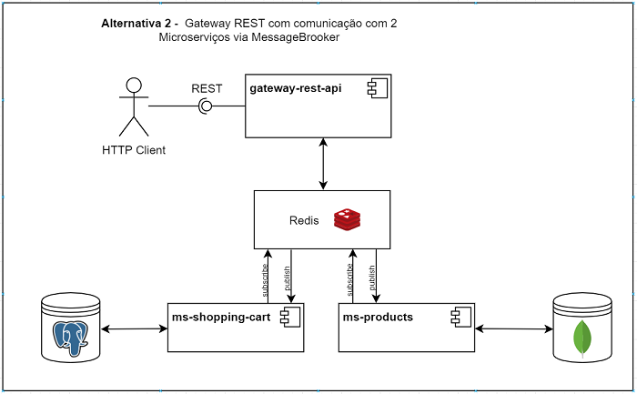
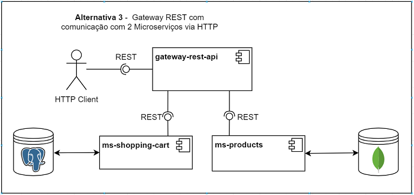

# Introdução

Este projeto foi desenvolvido numa framework de nodejs, denominada NestJS que tem como vantagens a sua escalabilidade, a sua documentação e rapidez de desenvolvimento.

# Problema
O problema a resolver é constituido por 3 aplicações distintas com as seguintes especificidades:

## 🌐 Rest Api
- Deverá conter endpoints:
    - para obter todos os produtos.
    - para adicionar produto ao carrinho de compras.
    - para remover produto do carrinho de compras.
    - para obter carrinho de compras.

## 📦 Micro serviço de produto
- Deverá fazer a persistência dos dados dos produtos numa db NoSQL, como MongoDB, e utilizar um ORM como o mongoose.

## 📦 Micro serviço de carrinho de compras
- Deverá fazer a persistência dos dados dos produtos numa db SQL, como PostgreSQL, e utilizar um ORM como o typeORM.

 

# Análise

### Foram identificadas 3 possíveis soluções para o problema:
 

### Arquitetura 1

Gateway REST com comunicação os 2 microserviços via TCP.

### Arquitetura 2

Gateway REST com comunicação os 2 microserviços via MessageBrooker.

### Arquitetura 3

Gateway REST com comunicação os 2 microserviços via HTTP.

## Decisões

A arquitetura escolhida foi a Arquitetura 1 
